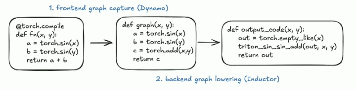
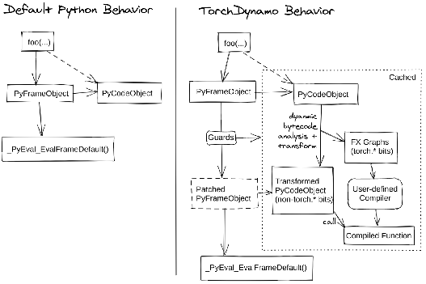
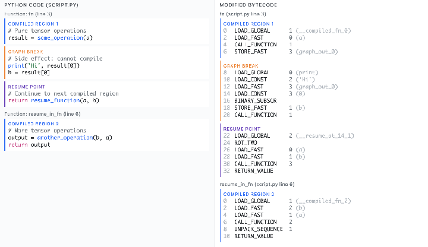

## Why `torch.compile`?

{width=90%}

PyTorch's eager mode is flexible and debuggable, but it pays a price: every op goes through the Python interpreter, tensor dispatch, and kernel launch one at a time. `torch.compile` closes the gap with JAX/XLA-style ahead-of-time compilation — without giving up Python dynamism.

> **JIT note:** Triton has CPU overhead per launch; CUDA Graphs help here. But Triton now also supports AOT kernels, making CUDA Graphs less necessary for pure-Triton workloads. `torch.compile` sits above all of this.

Related questions it addresses:

- When can ops be fused?
- How do graph breaks affect performance?
- How does it compare to JAX + XLA?

---

## `torch.compile` Under the Hood

The compiler pipeline has three logical stages: **Get-In** (trace Python), **Manipulate** (rewrite the graph), and **Be-ware** (pitfalls).

### I — Get-In: Hooking into CPython

**CPython** is both a compiler (to bytecode) and an interpreter (of that bytecode), frame by frame.

A **Frame** (`PyFrameObject`) is a snapshot of a function's state:

- The bytecode itself
- Namespaces — local and global variables
- The execution stack
- Exception state
- Built-ins (`print`, `len`)
- Trace/debug hooks

[PEP 523](https://peps.python.org/pep-0523/) exposes an API for a custom per-function interpreter. If one is installed, CPython will use it instead of the default. **Dynamo** leverages exactly this API: it defines a new interpreter that traces all PyTorch op calls and builds an FX graph as your code executes.

```
PyFrameObject (default eval) → PatchedPyFrameObject (Dynamo's eval)
```

The `@torch.compile` decorator's only job is to install the scaffolding that passes bytecode, args, and globals to Dynamo on the first call. **`@torch.compile` does not compile anything itself.**

{width=85%}

#### FX Graph

`torch.fx` traces your model symbolically and produces an **FX Graph** — a pure Python data structure representing the computation as a DAG of nodes. This is the IR that flows into the rest of the compiler:

```
Python source → Dynamo bytecode analysis → FX Graph → AOTAutograd → Inductor → Triton / C++
```

`torch.export` also produces an FX Graph, but via a stricter trace that bakes in shapes and constants (more on this below).

#### Guards — Making Dynamo Resilient

Every time Dynamo traces a function it attaches **guards** to the compiled artifact: checks on shapes, dtypes, values, and Python object identity that must hold for the compiled version to be reused.

When a guard is violated:

1. **Runtime overhead** — every call checks all guards
2. **Recompilation** — if a guard fails, Dynamo re-traces

Torch Compile adds guards for every user-accessible attribute. Use `tlparse` (or `TORCH_LOGS=guards`) to inspect guard overhead.

#### Dynamic Shapes & Recompilation

Guards + recompilation are the two main contributors to `torch.compile` being **slower than eager** in pathological cases. Understanding this lets you diagnose and eliminate the overhead.

| API | Effect |
|---|---|
| `torch.compile(dynamic=True)` | Dynamo uses symbolic integers for shapes; fewer recompilations |
| `torch.export(..., dynamic_shapes=...)` | Explicit shape constraints at export time |
| `torch._dynamo.mark_dynamic(x, dim=0)` | Mark a specific tensor dimension as dynamic |

---

### II — Manipulate: Bytecode Manipulation

Dynamo doesn't parse Python source — it works at the **bytecode** level. It walks `co_code`, intercepts `CALL_FUNCTION` / `CALL_METHOD` / `LOAD_ATTR` instructions that touch `torch.Tensor` objects, and emits graph nodes for each one. Non-Torch code (pure Python logic) passes through unchanged or causes a graph break.

---

### III — Be-ware: Graph Breaks & Recompilation

#### Graph Breaks

A **graph break** occurs when Dynamo encounters code it cannot represent in an FX Graph. It ends the current subgraph, lets the Python interpreter handle that piece, and starts a new subgraph afterwards.

Common causes:

1. **Data-dependent control flow** — Python `if/else` where the condition depends on tensor values. Fix: use `torch.cond()`, `torch.where()`, or restructure.
2. **`.item()`, `.tolist()`** — require a CPU↔GPU sync, forcing a break.
3. **`print()` statements** inside compiled code.
4. **Custom ops** (CUDA kernels, CUTLASS, user-defined Triton kernels) — Dynamo treats them as opaque callables.

{width=90%}

```python
# Forces a graph break — data-dependent branch
if x.sum() > 0:
    y = x * 2
else:
    y = x * -1

# Graph-friendly alternative
y = torch.where(x.sum() > 0, x * 2, x * -1)
```

Use `torch.compile(full_graph=True)` to make Dynamo **error out** on any graph break — it will tell you exactly where.

#### Recompilation

Dynamo captures separate graphs for **forward** and **backward** passes. The forward FX Graph is used by `AOTAutograd` to generate the compiled backward. Each forward graph has its own backward counterpart.

The backend is **Inductor**, which lowers the FX Graph to:

- **Triton** (default GPU backend) — generates fused CUDA kernels
- **C++** (CPU backend)

Under dynamic shapes, Dynamo uses **Sympy** for symbolic shape arithmetic, allowing a single compiled artifact to handle multiple shapes without recompilation.

::: {.callout-tip}
Instead of `torch.tensor() + 5` (constant scalar), prefer `torch.tensor() + torch.tensor(5)` to avoid shape-triggered recompilation.
:::

---

## `torch.compile` + CUDA Graphs

These two are **complementary**, not alternatives.

**`torch.compile`** is a compiler infrastructure: it traces your PyTorch code, generates an FX graph, lowers it through Inductor (defaulting to Triton), and produces optimized kernels with operator fusion.

**CUDA Graphs** solve a different problem: CPU-side kernel launch latency. Once the GPU work is captured into a graph, the CPU replays it with a single call instead of launching kernels one by one.

**Combined workflow:**

1. `torch.compile` your model — possibly into multiple subgraphs if there are graph breaks
2. Wrap the compiled model (+ optimizer step, etc.) in a CUDA Graph capture
3. Result: fused Triton kernels running with near-zero CPU overhead

```python
# mode="reduce-overhead" enables CUDA Graphs automatically
model = torch.compile(model, mode="reduce-overhead")

# PyTorch handles the graph capture transparently on the first few iterations
# and replays on all subsequent calls
```

::: {.callout-note}
`reduce-overhead` mode tries to use CUDA Graphs automatically, but it has constraints: no input mutations, static memory layout, limited graph dynamism. You may need to tweak your model slightly to be CUDA Graph-compatible.
:::

---

## Best Practices

### Full Graph & Avoiding Graph Breaks

- Use `full_graph=True` during debugging to surface breaks immediately
- Replace Python control flow with graph-friendly ops: `torch.where`, `torch.cond`
- Avoid `.item()`, `.numpy()`, `.tolist()` inside hot paths
- Custom ops show up as opaque callables — wrap them with `torch.library` if you want Dynamo to trace through them

### Handling Dynamic Shapes

```python
# Option 1: tell compile the shapes are dynamic
model = torch.compile(model, dynamic=True)

# Option 2: mark specific dimensions as dynamic
torch._dynamo.mark_dynamic(x, 0)   # batch dimension is dynamic

# Option 3: use torch.export with explicit constraints
from torch.export import Dim
batch = Dim("batch", min=1, max=256)
exported = torch.export.export(model, (x,), dynamic_shapes={"x": {0: batch}})
```

### Mixing CUDA Graphs with `torch.compile`

```python
import torch

stream = torch.cuda.Stream()
# Warm-up outside the graph
with torch.cuda.stream(stream):
    for _ in range(3):
        y = compiled_model(x)

# Capture
g = torch.cuda.CUDAGraph()
with torch.cuda.graph(g):
    y = compiled_model(x)

# Replay
g.replay()
```

### Reducing Compilation / Recompilation Time

```python
# Cache compiled artifacts to disk — avoids recompilation on restart
import torch._inductor.config
torch._inductor.config.fx_graph_cache = True   # Inductor kernel cache
```

```bash
# Persist the Dynamo cache across runs
TORCHINDUCTOR_CACHE_DIR=/tmp/inductor_cache python train.py
```

### Known Limitations (as of 2025)

1. **DeepSpeed ZeRO** — optimizer state sharding uses communication ops that Dynamo can't graph-capture. Results in graph breaks or silent fallback to eager.
2. **Gradient checkpointing** — checkpointed modules fall back to eager mode silently.

---

## `torch.export`

`torch.export` produces a **strict, fully-captured** FX Graph suitable for deployment (no Python fallback):

- **Containers** (dicts, lists of tensors) are burned in
- **Python constants** are burned in
- **`torch.tensor(...)` literals** are *not* burned in — they become graph inputs

```python
from torch.export import export, Dim

batch = Dim("batch", min=1, max=256)
exported_program = export(model, (x,), dynamic_shapes={"x": {0: batch}})
```

For models that use dataclasses as inputs:

```python
torch.export.register_dataclass(MyDataClass)
```

{width=80%}

{width=85%}

---

## Case Studies

### Case Study I — Compilation Failed

When `torch.compile` fails outright, the `TORCH_LOGS` environment variables are your primary diagnostic tool:

| Goal | `TORCH_LOGS` value |
|---|---|
| Why is it recompiling? | `recompiles` |
| Compilation stages | `compilation` |
| Generated FX graph | `graph_code` |
| Final kernel code | `output_code` |
| Where tracing breaks | `graph_breaks` |
| Guard conditions | `guards` |
| Performance hints | `perf_hints` |
| Dynamic shape decisions | `dynamic` |
| Symbolic sizes in graph | `graph_sizes` |
| AOT Autograd graphs | `aot_graphs` |
| Inductor optimization | `inductor` |
| Inductor scheduling | `schedule` |
| Everything | `+dynamo,+inductor` |

```bash
TORCH_LOGS=graph_breaks,guards python train.py
```

### Case Study II — Compilation Succeeded but No Speedup (or Regression)

Common root causes:

- **Too many graph breaks** — the model is running as many small compiled subgraphs stitched together by eager Python; overhead exceeds benefit
- **Excessive recompilation** — dynamic input shapes are triggering constant re-traces
- **Kernel launch latency dominates** — model is bottlenecked on CPU launch overhead that Inductor/Triton doesn't help with (here, add CUDA Graphs)
- **Compute-bound, already fast** — large matmuls already max out GPU throughput; fusion provides no gain

Diagnostic approach:
```bash
TORCH_LOGS=perf_hints,recompiles python train.py 2>&1 | head -100
```

### Case Study III — vLLM

vLLM uses `torch.compile` with PagedAttention and custom CUDA kernels. Key patterns:

- Custom ops registered via `torch.library` so Dynamo can trace through them
- `dynamic=True` to handle variable-length sequences without recompilation
- CUDA Graph capture for the decode phase (static shape) for near-zero CPU overhead
- Separate compiled graphs for prefill (dynamic) vs decode (static) paths

---

## `torch.compile` vs JAX + XLA

| | PyTorch + `torch.compile` | JAX + XLA |
|---|---|---|
| **Input IR** | FX Graph (via Dynamo) | HLO (High Level Operations) |
| **Lowering** | FX → Schedule IR → Triton / C++ | HLO → Optimized HLO → LLVM IR / Device IR |
| **Execution model** | Eager + JIT | Lazy (graph accumulation) |
| **Graph capture** | Dynamo via bytecode analysis | Trace-based (`jax.jit`) |
| **Compilation trigger** | First execution + guard violation | Explicit `mark_step()` / `jit` decoration |
| **Operator fusion** | Vertical + horizontal fusion | Aggressive multi-output fusion, cross control-flow |
| **Memory layout** | Basic optimization | Aggressive layout transforms (NCHW → NHWC) |
| **Algebraic simplifications** | Pattern matching | Deep algebraic rewrites, constant folding |
| **Key strength** | Hide latency (HBM load), vector units, comms behind MXUs | Cost model via OpenXLA / MLIR dialect stack |

XLA uses **MLIR** to define multiple dialects at different abstraction levels and progressively lowers between them — enabling deep fusion and aggressive memory layout transformations that Inductor doesn't yet match. PyTorch's advantage is the flexibility of staying in Python with optional compilation.

---

## References

1. [Dynamo Overview — PyTorch docs](https://docs.pytorch.org/docs/stable/torch.compiler_dynamo_overview.html)
2. [inductor/scheduler.py — `can_fuse()` / `score_fuse()` cost model](https://github.com/pytorch/torchdynamo/blob/be390ec752f540c13c116a1d04078fd577a26690/torchinductor/scheduler.py#L826)
3. [Dynamo Deep-Dive — PyTorch docs](https://docs.pytorch.org/docs/stable/torch.compiler_dynamo_deepdive.html)
4. [CUDAGraph Trees — PyTorch docs](https://docs.pytorch.org/docs/stable/torch.compiler_cudagraph_trees.html)
5. PyTorch 2 paper — *Faster Machine Learning Through Dynamic Python Bytecode Transformation and Graph Compilation*
6. [Blazing Fast GenAI Inference With torch.compile — Richard Zou, Meta](https://www.youtube.com/watch?v=1wV1ESbGrVQ)
